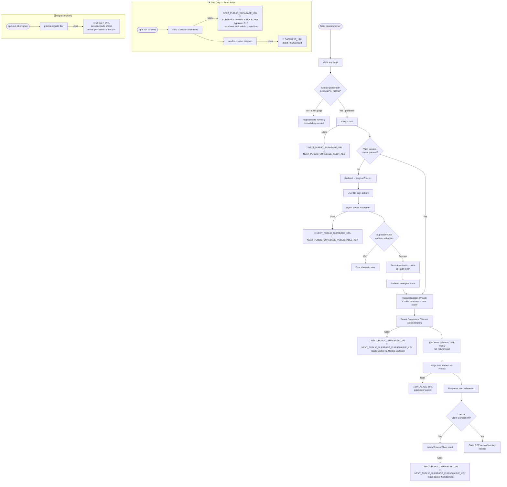

# Auth — Supabase SSR Session Management

> Last updated: June 2026

---

## Overview

This project uses **Supabase Auth with `@supabase/ssr`** for authentication.
The session is stored in **HTTP cookies**, not localStorage or sessionStorage.
The `proxy.ts` file at the project root is responsible for reading, validating, and refreshing the session on every request.

---

## Why Cookies, Not localStorage?

When you log in, `@supabase/ssr` writes the session into a secure HTTP cookie named:

```
sb-<project-ref>-auth-token
```

You will **not** see anything in localStorage or sessionStorage — this is intentional.
The browser **automatically attaches cookies to every HTTP request**, so the server always receives the session without any manual forwarding.

To inspect the cookie: **DevTools → Application → Cookies** (not Storage).

---

## Session Flow — Step by Step

### 1. Login

```
User submits sign-in form
  ↓
signIn() server action calls supabase.auth.signInWithPassword()
  ↓
Supabase Auth verifies credentials → returns session:
  - access_token  (JWT, expires ~users1 hour)
  - refresh_token (long-lived, used to get a new access_token)
  ↓
@supabase/ssr writes these into HTTP cookies automatically
  ↓
Browser stores the cookie — sent automatically on every future request
```

### 2. Every Subsequent Request (any route)

```
Browser navigates to any page
  ↓
Browser automatically attaches sb-<ref>-auth-token cookie to the request
  ↓
proxy.ts runs FIRST (before any page renders)
  ↓
  ├── Reads the auth cookie from the incoming request
  ├── Validates / refreshes the JWT
  ├── If protected route + no valid session → redirect to /login?next=...
  └── If valid → passes through, writes refreshed cookie back to response
  ↓
Page / Server Component renders
  ↓
server.ts createClient() reads the same cookie via Next.js cookies() API
  ↓
Any server action or RSC can call supabase.auth.getClaims() or getUser()
to get the current user — no extra DB call needed
```

---

## The Two Supabase Clients

Two separate clients are used — they do different jobs and must never be mixed up.

| Client | File | Runs in | How it reads the session |
|---|---|---|---|
| **Browser client** | `src/lib/supabse/client.ts` → `createBrowserClient` | Client Components (`"use client"`) | Reads the cookie directly from the browser |
| **Server client** | `src/lib/supabse/server.ts` → `createServerClient` | Server Components, Server Actions, Route Handlers | Reads the cookie via Next.js `cookies()` API |

### Browser Client (`client.ts`)

```ts
import { createBrowserClient } from "@supabase/ssr";

export const createClient = () =>
  createBrowserClient(
    process.env.NEXT_PUBLIC_SUPABASE_URL!,
    process.env.NEXT_PUBLIC_SUPABASE_PUBLISHABLE_KEY!,
  );
```

- Uses a **singleton pattern** internally — safe to call multiple times, only one instance is created.
- Use in any `"use client"` component (e.g. a hook, an interactive form).

### Server Client (`server.ts`)

```ts
import { createServerClient } from "@supabase/ssr";
import { cookies } from "next/headers";

export const createClient = (cookieStore: Awaited<ReturnType<typeof cookies>>) => {
  return createServerClient(
    process.env.NEXT_PUBLIC_SUPABASE_URL!,
    process.env.NEXT_PUBLIC_SUPABASE_PUBLISHABLE_KEY!,
    {
      cookies: {
        getAll() {
          return cookieStore.getAll()  // reads session from incoming request cookies
        },
        setAll(cookiesToSet) {
          try {
            cookiesToSet.forEach(({ name, value, options }) =>
              cookieStore.set(name, value, options)
            )
          } catch {
            // Called from a Server Component — safe to ignore.
            // proxy.ts handles writing cookies on every request.
          }
        },
      },
    },
  );
};
```

- Must be created **fresh on every server request** — it wraps the incoming request's cookies.
- The `try/catch` on `setAll` is intentional: Server Components can't write cookies, but `proxy.ts` handles all cookie writes before the component even runs.

---

## The Proxy (`proxy.ts`)

The Proxy is a Next.js concept (formerly called "middleware"). It runs **before every matched request** and is responsible for:

1. Refreshing the auth token when it's near expiry
2. Writing the refreshed token back into the response cookies (so the browser stays up-to-date)
3. Protecting routes — redirecting unauthenticated users to `/login?next=...`

```ts
// proxy.ts (root of project)
import { createServerClient } from '@supabase/ssr'
import { NextResponse, type NextRequest } from 'next/server'

export async function proxy(request: NextRequest) {
  let supabaseResponse = NextResponse.next({ request })

  const supabase = createServerClient(
    process.env.NEXT_PUBLIC_SUPABASE_URL!,
    process.env.NEXT_PUBLIC_SUPABASE_ANON_KEY!,
    {
      cookies: {
        getAll: () => request.cookies.getAll(),
        setAll: (cookiesToSet) => {
          cookiesToSet.forEach(({ name, value, options }) =>
            supabaseResponse.cookies.set(name, value, options)
          )
        },
      },
    }
  )

  // getClaims() verifies the JWT locally (no network call) and still refreshes
  // the session cookie when the token is near expiry — same as getUser() did.
  const { data } = await supabase.auth.getClaims()
  const isAuthenticated = !!data?.claims

  const isProtected =
    request.nextUrl.pathname.startsWith('/account') ||
    request.nextUrl.pathname.startsWith('/admin')

  if (isProtected && !isAuthenticated) {
    const url = request.nextUrl.clone()
    url.pathname = '/login'
    url.searchParams.set('next', request.nextUrl.pathname)
    return NextResponse.redirect(url)
  }

  return supabaseResponse
}

export const config = {
  matcher: ['/account/:path*', '/admin/:path*'],
}
```

> **Note:** The file is named `proxy.ts` (not `middleware.ts`) — this matches the current Supabase SSR documentation which refers to this layer as the "Proxy".

---

## Three Auth Methods — Which to Use

The latest Supabase docs (June 2026) define three methods. Choosing the wrong one is a common mistake.

| Method | What it does | Network call? | Use for |
|---|---|---|---|
| `getClaims()` | Validates JWT signature locally via WebCrypto + cached JWKS | ❌ No | **Protecting pages and reading user identity** — fastest, recommended |
| `getUser()` | Makes a live call to the Supabase Auth server for the latest user record | ✅ Yes | When you need the absolute freshest user data (e.g. after profile update) |
| `getSession()` | Returns the raw session (access_token, refresh_token) from storage — does **not** re-validate | ❌ No | Forwarding the access token to another service — **never use for auth checks** |

### Rule of thumb

```
Protecting a page or checking who's logged in  →  getClaims()
Need latest user data from the DB              →  getUser()
Need the raw token to forward elsewhere        →  getSession()
Never use getSession() for authorization       →  ❌ always leads to security issues
```

### `getClaims()` — How It Works Internally

```
supabase.auth.getClaims()
  ↓
Reads the access_token from the cookie
  ↓
Verifies JWT signature locally using WebCrypto API
  +  cached JWKS endpoint (project's public keys)
  ↓
Returns the decoded claims (user id, email, role, expiry, etc.)
  ↓
No network call to Supabase — runs entirely on your server
```

This is **faster and cheaper** than `getUser()` for every request. The token's signature cannot be forged, so it's safe to trust for identity checks.

### `getUser()` — When to Actually Use It

```ts
// Example: after the user updates their profile, confirm the change
const { data: { user } } = await supabase.auth.getUser()
// user.email, user.user_metadata, etc. are guaranteed fresh from Auth server
```

Use sparingly — it adds a network roundtrip to every call.

### Where Each Method Is Used in This Codebase

| Layer | Method | File |
|---|---|---|
| Server-side auth checks (route handlers, server actions) | `getClaims()` | `src/services/auth.service.ts` |
| Proxy route guard + session refresh | `getClaims()` | `proxy.ts` |

All server-side authorization goes through one shared helper — **`src/services/auth.service.ts`**:

| Function | Returns | Use for |
|---|---|---|
| `getSessionUserId(cookieStore)` | `string \| null` (the JWT `sub`) | Just need "is there a valid session + who" |
| `getSessionUser(cookieStore)` | `{ id, email, role } \| null` | Need the app **role** for a role check (role is read from the DB, not the JWT) |

> **Why the role comes from the DB:** the `role` claim inside the JWT is the *Postgres* role (always `authenticated`), **not** our app role (`user` / `seller` / `admin`). So `getSessionUser` verifies identity from the token via `getClaims()`, then reads the app role from the `users` row.

Consumers today: `POST /api/v1/datasets` (seller/admin only) and `uploadDatasetFilesAction` (seller/admin only).

> **Note on the proxy:** `proxy.ts` uses `getClaims()` to gate `/account/*` and `/admin/*`. `getClaims()` still refreshes the session cookie when the token is near expiry (the key side effect this middleware needs), so the swap from `getUser()` keeps that behavior while dropping the per-request network call. The proxy only checks that a session is *valid* — it does not read the app role (role checks happen in the route/action layer via `getSessionUser`).

---

## Auth Pages

| Route | File | Purpose |
|---|---|---|
| `/sign-up` | `src/app/(auth)/sign-up/page.tsx` | Register with email + password |
| `/sign-in` | `src/app/(auth)/sign-in/page.tsx` | Sign in with email + password |
| `/forgot-password` | `src/app/(auth)/forgot-password/page.tsx` | Send password reset email |
| `/reset-password` | `src/app/(auth)/reset-password/page.tsx` | Set a new password after reset link |

All 4 pages share the layout at `src/app/(auth)/layout.tsx` — dark glassmorphic design with animated gradient blobs.

### Server Actions (`src/actions/auth.actions.ts`)

| Action | What it does |
|---|---|
| `signUp(email, password)` | Registers via Supabase Auth, sends confirmation email |
| `signIn(email, password)` | Signs in via password, redirects to `/` |
| `signOut()` | Signs out, clears cookie, redirects to `/sign-in` |
| `forgotPassword(email)` | Sends reset email via `resetPasswordForEmail()` |
| `resetPassword(newPassword)` | Updates password via `updateUser()`, redirects to `/sign-in` |

---

## Protected Routes

The proxy currently guards these route prefixes:

```
/account/*   →  redirect to /login?next=/account/... if no session
/admin/*     →  redirect to /login?next=/admin/... if no session
```

When more protected routes are added (e.g. `/profile/*`), add them to the `matcher` in `proxy.ts` and add a corresponding `isProtected` check. am gonna update it 


---

## Role System

Roles are stored as a `text` field on the `users` table — three values:

| Role | Access |
|---|---|
| `user` | Standard buyer — orders, downloads, issues |
| `seller` | Dataset management, meet slot hosting, revenue dashboard |
| `admin` | Full access — all users, all datasets, analytics, issues |

Role is checked in profile pages and API routes, **not** enforced by the Proxy (the Proxy only checks whether a session exists, not what role it is).

---

## Environment Variables — Complete Reference

### All Keys and Their Purpose

| Variable | Visible to Browser? | Used By | Purpose |
|---|---|---|---|
| `NEXT_PUBLIC_SUPABASE_URL` | ✅ Yes | `client.ts`, `server.ts`, `proxy.ts`, seed | Supabase project endpoint — the base URL for all Supabase API calls |
| `NEXT_PUBLIC_SUPABASE_PUBLISHABLE_KEY` | ✅ Yes | `client.ts`, `server.ts` | Safe public key for browser + server auth — enables sign in/up, session read |
| `NEXT_PUBLIC_SUPABASE_ANON_KEY` | ✅ Yes | `proxy.ts` | Anon key used in the Proxy — functionally same as publishable key; **standardise to one name** |
| `DATABASE_URL` | ❌ Server only | `prisma.ts` (runtime) | Postgres via **pgbouncer transaction-mode pooler** — used for all runtime DB queries (`findMany`, `create`, etc.) |
| `DIRECT_URL` | ❌ Server only | `prisma.config.ts` (migrations) | Postgres via **session-mode pooler** — used by `prisma migrate` only (migrations need a persistent connection) |
| `NEXT_PUBLIC_APP_URL` | ✅ Yes | `auth.actions.ts` | Base URL of the app — appended to password reset redirect link sent in email |
| `SUPABASE_SERVICE_ROLE_KEY` | ❌ Server only | `prisma/seed.ts` only | **Admin-level key that bypasses RLS** — used in seed to create auth users via `supabase.auth.admin.*`. Never expose to browser. Never import in `src/`. |

---

### Security Boundary

```
┌─────────────────────────────────────────────────────────┐
│  BROWSER-SAFE  (NEXT_PUBLIC_* prefix)                   │
│                                                          │
│  NEXT_PUBLIC_SUPABASE_URL                               │
│  NEXT_PUBLIC_SUPABASE_PUBLISHABLE_KEY                   │
│  NEXT_PUBLIC_SUPABASE_ANON_KEY                          │
│  NEXT_PUBLIC_APP_URL                                    │
└─────────────────────────────────────────────────────────┘

┌─────────────────────────────────────────────────────────┐
│  SERVER-ONLY  (no NEXT_PUBLIC_ prefix)                  │
│                                                          │
│  DATABASE_URL           → Prisma runtime queries        │
│  DIRECT_URL             → Prisma migrations only        │
│  SUPABASE_SERVICE_ROLE_KEY → seed only, bypasses RLS   │
└─────────────────────────────────────────────────────────┘
```

> ⚠️ **`SUPABASE_SERVICE_ROLE_KEY` must NEVER appear in any `src/` file.** It bypasses all Row-Level Security policies — if leaked to the browser, any user can read/write any row in the DB.

---

### Which Key is Active — User Interaction Flowchart



---

### Key-by-Key Interaction Summary

#### `NEXT_PUBLIC_SUPABASE_URL`
- **When active:** Every single Supabase call — browser, server, proxy, seed
- **Who uses it:** `client.ts`, `server.ts`, `proxy.ts`, `prisma/seed.ts`
- **What happens without it:** All Supabase calls fail immediately — app is completely broken

#### `NEXT_PUBLIC_SUPABASE_PUBLISHABLE_KEY`
- **When active:** Sign-in, sign-up, forgot password, reset password, any server action reading the session, any client component calling Supabase
- **Who uses it:** `client.ts` (browser), `server.ts` (SSR)
- **What happens without it:** Auth forms fail, server components can't read the session

#### `NEXT_PUBLIC_SUPABASE_ANON_KEY`
- **When active:** Every HTTP request that hits a protected route (`/account/*`, `/admin/*`)
- **Who uses it:** `proxy.ts` only
- **What happens without it:** Proxy can't validate sessions — protected routes break
- **⚠ Standardise:** This and `PUBLISHABLE_KEY` should be the same value. Pick one name and update `proxy.ts` to use `NEXT_PUBLIC_SUPABASE_PUBLISHABLE_KEY`

#### `DATABASE_URL`
- **When active:** Any Prisma query at runtime — `findMany`, `create`, `update`, `delete`
- **Who uses it:** `src/lib/prisma.ts` (singleton used by all services)
- **What happens without it:** All DB queries fail — datasets page, profile, everything breaks
- **Note:** Uses pgbouncer transaction-mode — compatible with Prisma's pooled queries

#### `DIRECT_URL`
- **When active:** Only when running `npm run db:migrate` or `npm run db:push`
- **Who uses it:** `prisma.config.ts` datasource
- **What happens without it:** Migrations fail (session-mode pooler required for DDL statements)
- **Never needed at runtime** — not used by the app server

#### `NEXT_PUBLIC_APP_URL`
- **When active:** When user clicks "Forgot Password" → `forgotPassword()` server action
- **Who uses it:** `src/actions/auth.actions.ts` — appended as `redirectTo` in the reset email
- **What happens without it:** Password reset emails send but the link points to `undefined/reset-password` — broken reset flow 

#### `SUPABASE_SERVICE_ROLE_KEY`
- **When active:** Only during `npm run db:seed` — never at runtime
- **Who uses it:** `prisma/seed.ts` → `supabase.auth.admin.createUser()`
- **What it does:** Bypasses all RLS policies — can read/write any row, create any auth user
- **What happens without it:** Seed script fails — `supabaseKey is required` error
- **Security rule:** Must never appear in any file inside `src/`. Dev/seed use only.
