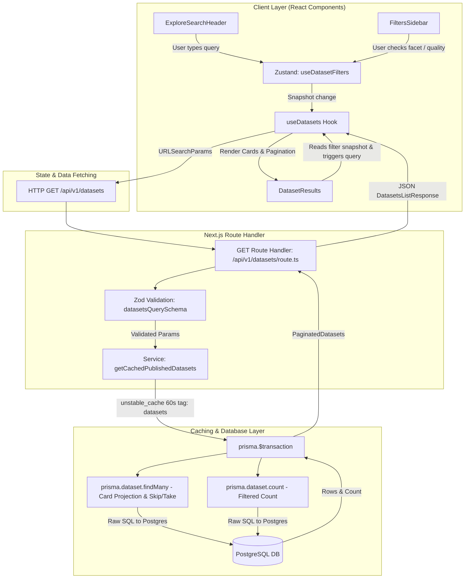
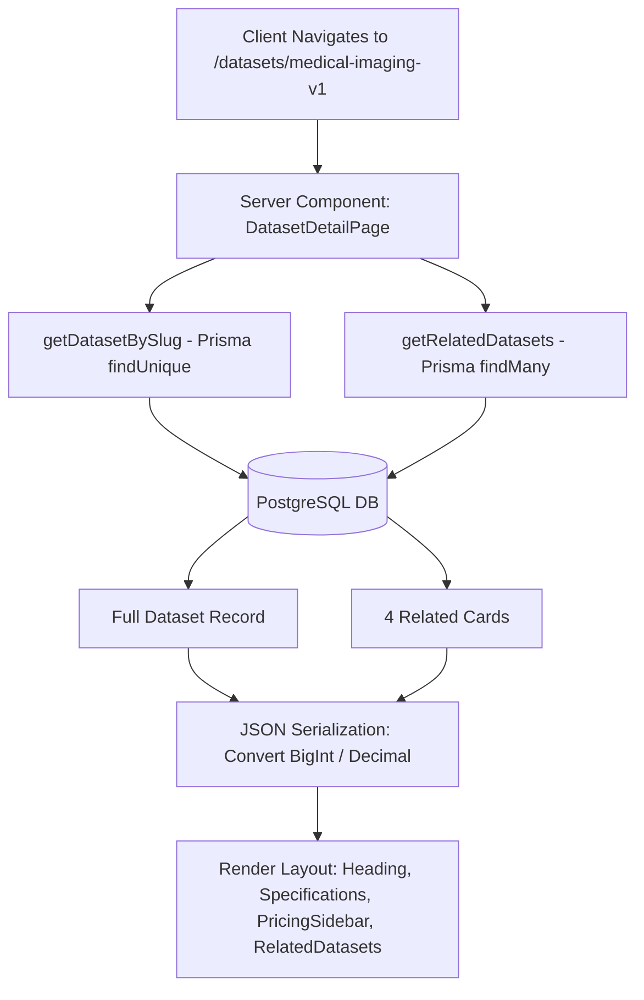
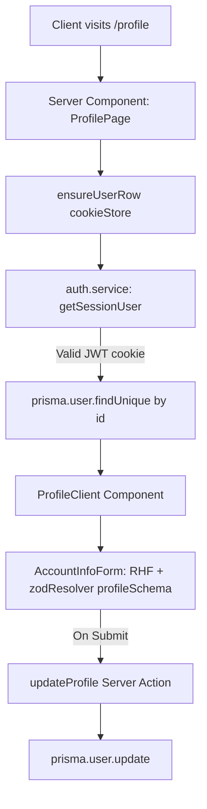

# Datasets & Explore Flow — End-to-End Architecture & Technical Specification

> Last updated: 22 July 2026

---

## Overview

This document provides a comprehensive end-to-end technical specification for the **Datasets Marketplace** core features in this codebase. It documents the full architectural pipeline — spanning the React UI components, Zustand client state stores, Zod validation schemas, TanStack Query hooks, Next.js API route handlers, Prisma ORM service layer, Postgres database queries, pagination mechanics, and algorithmic complexity analysis.

The architecture covers three primary application areas:
1. **Explore & Search Marketplace (`/datasets`)**
2. **Dataset Details Page (`/datasets/[slug]`)**
3. **User Profile Section (`/profile`)**

*(Note: Payments and checkout integrations are documented separately in `dodopayments.md`.)*

---

## 1. Explore Marketplace (`/datasets`) — Architectural Flow

### High-Level End-to-End Data Flow



---

### Step 1: UI Components & React Layout (`src/app/(public)/datasets/page.tsx`)

The main explore page is rendered at `/datasets`. It uses a sticky layout where the header collapses on scroll and the filter sidebar stays pinned to the viewport:

- **`ExploreSearchHeader`** (`src/components/search-datasets/explore-search-header.tsx`): A full-width sticky band containing the search input box. It updates search text in local component state and commits it to the Zustand filter store upon form submission (or enter key press).
- **`FiltersSidebar`** (`src/components/search-datasets/filters-sidebar.tsx`): Displays multi-select facet groups (Industry, Modality, Use Case, License Type, Compliance, Annotation Type, Collection Method) and a minimum quality score filter. It queries facet counts via `useDatasetFacets()`.
- **`DatasetResults`** (`src/components/search-datasets/dataset-results.tsx`): Reads active dataset cards, total count, loading/error states from `useDatasets()`, renders the card grid, and displays page navigation controls.

---

### Step 2: Zustand Client State Management (`src/stores/dataset-filters.store.ts`)

Filter states are managed in client memory using Zustand (`useDatasetFilters`).

#### Store Interface & State Structure
```ts
export type FacetKey =
  | 'industry'
  | 'modality'
  | 'useCase'
  | 'licenseType'
  | 'compliance'
  | 'annotationType'
  | 'collectionMethod'

export type DatasetFacetSelections = Record<FacetKey, string[]>

interface DatasetFiltersState {
  q: string                          // Free-text search term
  facets: DatasetFacetSelections     // Array of checked values per facet key
  minQuality: number | null          // Minimum quality threshold (0–10)
  sort: DatasetSort                  // Sort order: 'recent' | 'quality' | 'price_asc' | 'price_desc'
  page: number                       // 1-indexed current page number

  setSearch: (q: string) => void
  toggleFacet: (key: FacetKey, value: string) => void
  setMinQuality: (score: number | null) => void
  setSort: (sort: DatasetSort) => void
  setPage: (page: number) => void
  clearAll: () => void
}
```

#### Page Reset Logic
To prevent out-of-range pagination errors (e.g., being on Page 5 when a new filter reduces total pages to 2), **every filter mutation action automatically resets `page` back to 1**:
- `setSearch(q)` $\rightarrow$ resets `page: 1`
- `toggleFacet(key, value)` $\rightarrow$ toggles item in array and resets `page: 1`
- `setMinQuality(score)` $\rightarrow$ resets `page: 1`
- `setSort(sort)` $\rightarrow$ resets `page: 1`
- `setPage(page)` $\rightarrow$ updates `page` only

---

### Step 3: TanStack Query Data Fetching Hooks (`src/hooks/use-datasets.ts`)

Data fetching is decoupled from component lifecycle via TanStack Query (`useQuery`).

#### Query Key Synchronization & Search Parameter Construction
```ts
export function useDatasets() {
  const { q, facets, minQuality, sort, page } = useDatasetFilters()

  return useQuery({
    queryKey: ['datasets', { q, facets, minQuality, sort, page }],
    queryFn: () => fetchDatasets(buildSearchParams(useDatasetFilters.getState())),
    placeholderData: (previousData) => previousData, // Keeps previous result visible while fetching next page
  })
}
```

The `queryKey` includes a full snapshot of all active filter parameters. Whenever any store parameter changes, TanStack Query automatically invalidates the key and initiates a new fetch.

#### `buildSearchParams` Utility
Transforms the Zustand store snapshot into an HTTP URL query string:
- `page` $\rightarrow$ `String(page)`
- `limit` $\rightarrow$ `12` (fixed page size)
- `sort` $\rightarrow$ `'recent' | 'quality' | 'price_asc' | 'price_desc'`
- `q` $\rightarrow$ trimmed string parameter
- Multi-select facets $\rightarrow$ comma-separated string (e.g. `industry=Healthcare,Finance`)

---

### Step 4: Server-Side Zod Validation (`src/validations/dataset.schema.ts`)

When `GET /api/v1/datasets` receives an incoming request, query parameters are parsed and validated using Zod:

```ts
export const datasetsQuerySchema = z.object({
  page: z.coerce.number().int().positive().default(1),
  limit: z.coerce.number().int().positive().max(100).default(12),
  q: z.string().trim().max(100).optional(),
  industry: csvList().optional(),          // csvList transforms "a,b" -> ["a", "b"]
  modality: csvList().optional(),
  useCase: csvList().optional(),
  licenseType: csvList().optional(),
  annotationType: csvList().optional(),
  collectionMethod: csvList().optional(),
  compliance: csvList().optional(),
  minQuality: z.coerce.number().min(0).max(10).optional(),
  category: filterText().optional(),
  language: filterText().optional(),
  currency: z.string().trim().length(3).transform(v => v.toUpperCase()).optional(),
  fileFormat: filterText().optional(),
  tags: csvList(20, 50).optional(),
  minPrice: priceBound().optional(),
  maxPrice: priceBound().optional(),
  sort: z.enum(['recent', 'quality', 'price_asc', 'price_desc']).default('recent'),
}).refine(
  (data) => data.minPrice === undefined || data.maxPrice === undefined || data.minPrice <= data.maxPrice,
  { message: 'minPrice cannot be greater than maxPrice', path: ['minPrice'] }
)
```

**Key Validation Rules:**
- `csvList()` helper splits comma-separated URL strings, trims whitespace, filters empty elements, and bounds maximum item count (default 20) and string length (default 100).
- `limit` is hard-capped at 100 to protect server memory.
- `minPrice` / `maxPrice` refine check guarantees range consistency before database querying.

---

### Step 5: Database Query Execution & Prisma Layer (`src/services/dataset.service.ts`)

#### 1. Query Filter Construction (`buildDatasetWhere`)
Converts validated Zod query parameters into a `Prisma.DatasetWhereInput` object:

```ts
function buildDatasetWhere(params: DatasetsQueryParams): Prisma.DatasetWhereInput {
  const { q, industry, modality, useCase, licenseType, compliance, minQuality, minPrice, maxPrice, tags } = params

  return {
    ...(q && {
      OR: [
        { title: { contains: q, mode: 'insensitive' } },
        { description: { contains: q, mode: 'insensitive' } },
      ],
    }),
    ...(industry && industry.length > 0 && { industry: { in: industry } }),
    ...(modality && modality.length > 0 && { modality: { in: modality } }),
    ...(useCase && useCase.length > 0 && { useCase: { in: useCase } }),
    ...(licenseType && licenseType.length > 0 && { licenseType: { in: licenseType } }),
    ...(compliance && compliance.length > 0 && { compliance: { hasSome: compliance } }), // Postgres text[] array lookup
    ...(minQuality !== undefined && { qualityScore: { gte: minQuality } }),
    ...(tags && tags.length > 0 && { tags: { hasSome: tags } }),                           // Postgres text[] array lookup
    ...((minPrice !== undefined || maxPrice !== undefined) && {
      price: {
        ...(minPrice !== undefined && { gte: minPrice }),
        ...(maxPrice !== undefined && { lte: maxPrice }),
      },
    }),
  }
}
```

#### 2. Atomic Transaction Query
To prevent race conditions where total item count changes between fetching records and fetching counts, both queries are executed concurrently in a single Prisma transaction:

```ts
const [rows, total] = await prisma.$transaction([
  prisma.dataset.findMany({
    where,
    select: CARD_SELECT, // Lightweight projection returning only card fields
    orderBy: ORDER_BY[sort],
    skip: (page - 1) * limit,
    take: limit,
  }),
  prisma.dataset.count({ where }),
])
```

#### 3. Response & Pagination Metadata
The route handler computes total pages and returns JSON:
```ts
return NextResponse.json({
  datasets,
  pagination: {
    page: query.page,
    limit: query.limit,
    total,
    totalPages: Math.ceil(total / query.limit),
  },
})
```

---

### Complexity Analysis for `/datasets`

| Operation | Time Complexity | Space Complexity | Notes |
|---|---|---|---|
| **Zod Query Validation** | $O(M)$ | $O(M)$ | $M$ is total characters across URL search params (bounded by schema limits) |
| **Prisma Filter Assembly** | $O(F)$ | $O(F)$ | $F$ is number of active filter clauses |
| **Postgres Text Search (`contains`)** | $O(N)$ sequential / $O(\log N + K)$ indexed | $O(K)$ | Case-insensitive `ILIKE` search. Scales with GIN/trigram index on `title` & `description` |
| **Postgres Array Search (`hasSome`)** | $O(\log N + K)$ | $O(K)$ | Uses GIN index on `tags` / `compliance` array columns |
| **Offset Pagination (`skip`/`take`)** | $O(\text{skip} + \text{take})$ | $O(\text{limit})$ | Postgres scans $\text{skip} = (\text{page} - 1) \times \text{limit}$ rows before yielding $\text{take} = \text{limit}$ records |
| **Total API Response** | $O(\text{skip} + \text{limit} + \log N)$ | $O(\text{limit})$ | $\text{limit} = 12$ by default |

---

## 2. Dataset Details Route (`/datasets/[slug]`)

### Architecture & Data Flow



### Server Component Execution (`src/app/(public)/datasets/[id]/page.tsx`)

1. **Slug Lookup**: Receives `params.id` (acting as `slug`). Fetches full record via `getDatasetBySlug(slug)`:
   ```ts
   prisma.dataset.findUnique({ where: { slug } })
   ```
   If no row matches, `notFound()` triggers Next.js 404.

2. **Related Datasets Retrieval**: Calls `getRelatedDatasets(dataset, 4)`:


   ```ts
   prisma.dataset.findMany({
     where: {
       id: { not: dataset.id },
       OR: [
         { category: dataset.category },
         { industry: dataset.industry },
       ],
     },
     select: CARD_SELECT,
     orderBy: { qualityScore: 'desc' },
     take: 4,
   })
   ```

3. **Safe Serialization for Client Components**:
   Postgres `BigInt` (`fileSizeBytes`, `recordCount`) and `Decimal` (`price`) cannot be directly passed into Client Components in Next.js. They are sanitized via JSON stringify/parse:
   ```ts
   const safeDataset = JSON.parse(
     JSON.stringify(dataset, (_key, value) =>
       typeof value === 'bigint' ? Number(value) : value
     )
   )
   ```

### Complexity Analysis for `/datasets/[slug]`

| Operation | Time Complexity | Space Complexity | Notes |
|---|---|---|---|
| **Dataset Slug Lookup** | $O(1)$ | $O(1)$ | Unique B-tree index lookup on `slug` column |
| **Related Datasets Lookup** | $O(\log N + K)$ | $O(K)$ | B-tree index scan on `category` / `industry`, $K=4$ records |
| **BigInt/Decimal Serialization** | $O(R)$ | $O(R)$ | $R$ is total fields on single dataset record (~30 properties) |

---

## 3. Profile Section (`/profile`)

### Architecture & Data Flow



### Server Component Execution (`src/app/profile/page.tsx`)

1. **Authentication Check**: Calls `ensureUserRow(cookieStore)`. It inspects the `@supabase/ssr` HTTP cookie using `getClaims()` (local WebCrypto signature check). If unauthenticated, it redirects to `/`.
2. **User Data Query**: Queries current profile details:
   ```ts
   const dbUser = await prisma.user.findUnique({
     where: { id: session.id },
     select: {
       fullName: true,
       email: true,
       organization: true,
       industry: true,
       jobTitle: true,
     },
   })
   ```
3. **UI Rendering**: Renders `ProfileClient` containing:
   - `AccountInfoForm`: Built using React Hook Form and `zodResolver(profileSchema)` from `src/validations/auth.schema.ts`.
   - `SecuritySettings`: Password change / session security options.
   - `SavedDatasets`: User bookmarks / purchase history tabs.

### Validation Schema (`src/validations/auth.schema.ts`)
```ts
export const profileSchema = z.object({
  fullName: z.string().trim().max(120, 'Name is too long.').optional(),
  organization: z.string().trim().max(160, 'Organization is too long.').optional(),
  industry: z.string().trim().max(120, 'Industry is too long.').optional(),
  jobTitle: z.string().trim().max(120, 'Role is too long.').optional(),
})
```

### Complexity Analysis for `/profile`

| Operation | Time Complexity | Space Complexity | Notes |
|---|---|---|---|
| **JWT Verification (`getClaims`)** | $O(1)$ | $O(1)$ | Local WebCrypto signature check against cached JWKS (zero network calls) |
| **User Row Lookup** | $O(1)$ | $O(1)$ | Primary key B-tree index lookup on `users.id` (UUID) |
| **Profile Update Action** | $O(1)$ | $O(1)$ | Single row update by primary key |

---

## Summary of Core Validation & State Matrix

| Feature Route | Zustand Store | Zod Schema | Service / Action | Primary DB Operations |
|---|---|---|---|---|
| **Explore (`/datasets`)** | `useDatasetFilters` | `datasetsQuerySchema` | `getCachedPublishedDatasets` | `prisma.dataset.findMany` + `prisma.dataset.count` |
| **Explore Facets** | N/A (TanStack Query) | N/A | `getCachedDatasetFacets` | `prisma.dataset.groupBy` on 4 columns |
| **Dataset Details (`/datasets/[slug]`)** | N/A | N/A | `getDatasetBySlug`, `getRelatedDatasets` | `prisma.dataset.findUnique` + `prisma.dataset.findMany` |
| **Create Dataset (`POST /api/v1/datasets`)**| N/A | `createDatasetSchema`, `uploadUrlSchema` | `storage.service`, `createDatasetProduct` | `prisma.dataset.create` |
| **User Profile (`/profile`)** | N/A | `profileSchema` | `updateProfile` action | `prisma.user.findUnique`, `prisma.user.update` |
